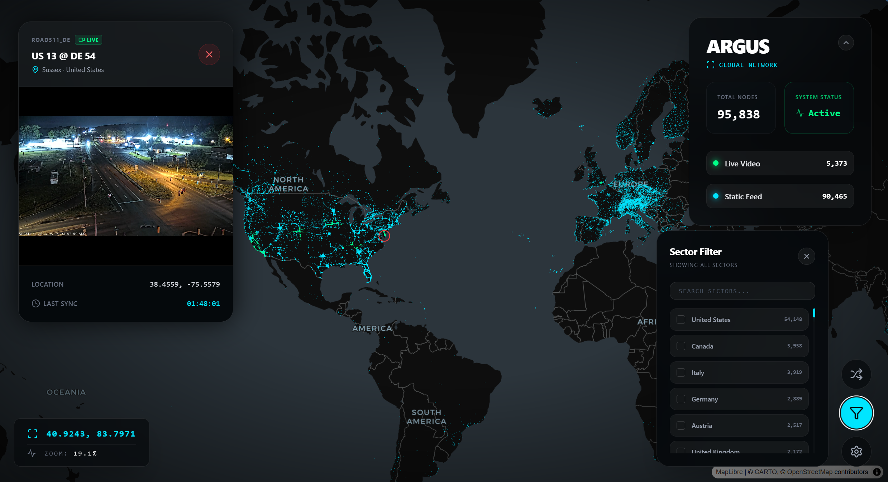

# ARGUS — Global Camera Intelligence

Argus is a high-performance, tactical surveillance dashboard that aggregates and visualizes global open-data camera feeds. It provides real-time monitoring of **~95,000+ camera nodes** across highways, landmarks, and urban centers worldwide.

## Demo




---

## Features

- **Global Surveillance Scale** — Comprehensive visualization of ~95,000 nodes across 120+ international sectors.
- **Geospatial Rendering** — GPU-accelerated tactical mapping utilizing Deck.GL and MapLibre for seamless navigation.
- **Adaptive Stream Processing** — Intelligent feed management supporting low-latency HLS video and high-frequency imaging.
- **Modular Ingestion Framework** — Extensible Python-based pipeline for multi-source data aggregation and standardization.

---

## Project Structure

```text
Argus/
├── public/
│   └── cameras.geojson          # The main camera dataset (auto-generated)
├── scripts/                     # Python Data Pipeline
│   ├── scraper.py                # Unified CLI runner — the only script you need
│   ├── scrapers/
│   │   ├── utils.py             # Shared helpers (build_feature, log, HEADERS)
│   │   ├── global/
│   │   │   └── windy.py         # Windy Webcams (73k+ global)
│   │   ├── usa/
│   │   │   ├── road511.py       # Road511 multi-state (20 states)
│   │   │   ├── california/
│   │   │   │   └── caltrans.py  # Caltrans CCTV
│   │   │   ├── new_york/
│   │   │   │   └── nyc_dot.py   # NYC DOT
│   │   │   └── iowa/
│   │   │       └── iowa511.py   # Iowa DOT (ArcGIS)
│   │   ├── canada/
│   │   │   └── bc/
│   │   │       └── drivebc.py   # DriveBC
│   │   ├── asia/
│   │   │   └── singapore/
│   │   │       └── lta.py       # Singapore LTA
│   │   ├── europe/
│   │   │   └── uk/
│   │   │       └── tfl_london.py# TfL London
│   │   └── oceania/
│   │       └── nz/
│   │           └── nzta.py      # NZTA New Zealand
│   └── legacy/                  # Retired scripts
├── src/                         # React Frontend
└── .env                         # API Keys (git-ignored)
```

---

## Setup & Installation

### 1. Frontend

```bash
npm install
npm run dev
```

### 2. Python Pipeline

**Requirements:** Python 3.9+ and `pip install requests`

**API Keys** — create a `.env` file in the project root:
```env
WINDY_API_KEY=your_key_here
VITE_WINDY_API_KEY=your_key_here
```
> Get a free Windy key at [api.windy.com](https://api.windy.com/) — required only for the `windy` plugin. All other sources need no key.

---

## Running the Data Pipeline

All scraping is done through a single unified engine. Run from the **`scripts/`** directory:

```bash
cd scripts
```

### See all available plugins

```bash
python scraper.py --list
```

### Common workflows

| Goal | Command |
|---|---|
| Full global run (everything) | `python scraper.py --all` |
| Windy only (the big 73k run) | `python scraper.py --plugins windy` |
| All fast sources, skip Windy | `python scraper.py --all --exclude windy` |
| Specific plugins | `python scraper.py --plugins drivebc tfl_london nyc_dot` |
| Remove stale cameras & refresh | `python scraper.py --all --replace-source` |
| Nuke and rebuild from scratch | `python scraper.py --all --fresh` |
| Custom output path | `python scraper.py --all --output ../public/cameras.geojson` |
| Run plugins in parallel | `python scraper.py --all --exclude windy --parallel` |

> **Default output:** `public/cameras.geojson` — the React app reads directly from this file.

### Road511 per-state targeting (`--states`)

The `road511_usa` plugin supports a `--states` flag to target specific states. This bypasses all exclusion rules, so you can also pull states normally handled by dedicated plugins (CA, IA, NY) to check for gaps.

| Goal | Command |
|---|---|
| Refresh one state | `python scraper.py --plugins road511_usa --states CO` |
| Refresh multiple states | `python scraper.py --plugins road511_usa --states FL WA OR` |
| Pull a normally-skipped state | `python scraper.py --plugins road511_usa --states CA NY` |
| Re-scrape & replace stale data | `python scraper.py --plugins road511_usa --states TN --replace-source` |

### Update Modes

| Mode | What it does |
|---|---|
| *(default — upsert)* | Loads existing data, refreshes known cameras by ID, appends new ones. Safe to re-run anytime. |
| `--replace-source` | Drops all cameras from the sources being run, then inserts fresh results. **Use this to remove stale/offline cameras.** Other sources are untouched. |
| `--fresh` | Ignores existing file entirely. Writes only what was just fetched. Use to fully rebuild from scratch. |

### Windy Full Global Run

The Windy plugin runs in two phases automatically:

1. **Phase 1** — Scans the globe with a 20°×20° grid (162 boxes)
2. **Phase 2** — Any box returning ≥999 cameras is recursively subdivided into quadrants until fully drained

```bash
python scraper.py --plugins windy
```

> ⚠ Takes **10–30 minutes** depending on connection speed. HTTP 429 rate limits are handled automatically with a 10-second backoff.

---

## Data Sources

| Plugin Alias | Source | Region | Camera Count | Live HLS? | API Key |
|:---|:---|:---|:---|:---|:---|
| `windy` | [Windy Webcams](https://api.windy.com/) | 🌍 Global | ~73,700 | ❌ Image only | ✅ Required (Free) |
| `road511_usa` | [Road511](https://api.road511.com/) | 🇺🇸 United States | ~15,000 | ✅ CO, TN, DE | ❌ None |
| `caltrans` | [Caltrans CCTV](https://cwwp2.dot.ca.gov/) | 🇺🇸 California, USA | ~3,300 | ✅ Yes | ❌ None |
| `nyc_dot` | [NYC TMC](https://webcams.nyctmc.org/) | 🇺🇸 New York City, USA | ~950 | ❌ Image only | ❌ None |
| `iowa_dot` | [Iowa DOT](https://services.arcgis.com/8lRhdTsQyJpO52F1/ArcGIS/rest/services/Traffic_Cameras_View/FeatureServer/0) | 🇺🇸 Iowa, USA | ~850 | ✅ Yes | ❌ None |
| `drivebc` | [DriveBC](https://www.drivebc.ca/) | 🇨🇦 British Columbia, CA | ~1,040 | ❌ Image only | ❌ None |
| `tfl_london` | [Transport for London](https://api.tfl.gov.uk/) | 🇬🇧 London, UK | ~800 | ❌ Image only | ❌ None |
| `singapore_lta` | [Singapore LTA](https://data.gov.sg/) | 🇸🇬 Singapore | ~90 | ❌ Image only | ❌ None |
| `nzta` | [NZTA Journeys](https://www.journeys.nzta.govt.nz/) | 🇳🇿 New Zealand | ~varies | ❌ Image only | ❌ None |

### Road511 State Coverage

The `road511_usa` plugin covers the following states. States marked **Live** have confirmed CORS-compatible HLS streams; others are image-only.

| State | Cameras | Feed Type |
|---|---|---|
| Florida | ~3,500 | Image (JPEG) |
| Utah | ~1,500 | Image (JPEG) |
| Washington | ~1,500 | Image (JPEG) |
| Oregon | ~1,080 | Image (JPEG) |
| Colorado | ~900 | **Live HLS** ✅ |
| South Carolina | ~755 | Image (JPEG) |
| Indiana | ~530 | Image (JPEG) |
| Tennessee | ~668 | **Live HLS** ✅ |
| Arizona | ~643 | Image (JPEG) |
| Kansas | ~576 | Image (JPEG) |
| Arkansas | ~545 | Image (JPEG) |
| Ohio | ~500 | Image (JPEG) |
| Kentucky | ~362 | Image (JPEG) |
| Nebraska | ~350 | Image (JPEG) |
| Delaware | ~345 | **Live HLS** ✅ |
| Massachusetts | ~305 | Image (JPEG) |
| Wyoming | ~220 | Image (JPEG) |
| North Dakota | ~185 | Image (JPEG) |
| South Dakota | ~43 | Image (JPEG) |
| Montana | ~38 | Image (JPEG) |

> States with no usable feed URLs (TX, NC, WI, GA, NV, PA, MI, ID, LA, MS, CT, ME, NH, WV, VT) are excluded automatically.

---

## Adding a New Scraper Plugin

The engine auto-loads any plugin registered in `PLUGIN_REGISTRY` inside `scraper.py`.

### Step 1 — Create the scraper file

Create a `.py` file under the appropriate region folder in `scripts/scrapers/`. It **must** export a `fetch(config)` function returning a list of GeoJSON Feature dicts.

```python
# scripts/scrapers/usa/my_state/my_source.py
from scrapers.utils import log, build_feature, HEADERS
import requests

PLUGIN_META = {
    "name":         "My New Source",
    "key_required": False,
    "description":  "Short description of what this scrapes",
}

def fetch(config: dict) -> list[dict]:
    log("Fetching My New Source...")
    features = []

    try:
        resp = requests.get("https://example.gov/api/cameras", headers=HEADERS,
                            timeout=config.get("TIMEOUT", 15))
        resp.raise_for_status()
        cams = resp.json()
    except Exception as e:
        log(f"Fetch failed: {e}", "ERROR")
        return []

    for cam in cams:
        try:
            lat = float(cam["lat"])
            lon = float(cam["lon"])
            if lat == 0 and lon == 0:
                continue

            features.append(build_feature(
                cam_id     = str(cam["id"]),
                name       = cam.get("name", "Unknown Camera"),
                lat        = lat,
                lon        = lon,
                feed_url   = cam.get("imageUrl", ""),   # static JPEG snapshot
                stream_url = cam.get("streamUrl", ""),  # HLS .m3u8 (optional)
                cam_type   = "traffic",
                city       = cam.get("city", ""),
                country    = "US",
                source     = "my_new_source",
            ))
        except Exception:
            continue

    log(f"My New Source: {len(features)} cameras loaded", "OK")
    return features
```

> **`build_feature` signature:**
> ```python
> build_feature(cam_id, name, lat, lon, feed_url, cam_type, city, country, source,
>               stream_url="",       # HLS .m3u8 URL — only set if CORS: * confirmed
>               player_url="",       # Link to a viewer page (optional)
>               feed_type="image/jpeg",
>               **kwargs)            # Any extra properties
> ```
> ⚠ Only set `stream_url` if you've confirmed the host returns `Access-Control-Allow-Origin: *`. Streams without CORS will fail silently in HLS.js. Test with: `curl -I <stream_url>` and check the `Access-Control-Allow-Origin` header.

### Step 2 — Register it in `scraper.py`

```python
PLUGIN_REGISTRY = {
    # ... existing entries ...

    "my_new_source": {
        "module":      "scrapers.usa.my_state.my_source",
        "name":        "My New Source",
        "key":         None,                      # or "MY_API_KEY_ENV_VAR"
        "description": "Short description shown in --list",
    },
}
```

### Step 3 — If it needs an API key

Add to `.env`:
```env
MY_API_KEY=your_key_here
```

Reference in `scraper.py`'s `CONFIG` dict:
```python
CONFIG = {
    # ...
    "MY_API_KEY": os.getenv("MY_API_KEY"),
}
```

Read in your plugin via `config.get("MY_API_KEY")`.

### Step 4 — Run it

```bash
cd scripts
python scraper.py --plugins my_new_source
```

---

## Environment Configuration

Create a `.env` file in the **project root** (`Argus/.env`):

```env
# Required for the Windy plugin (73k+ global cameras)
WINDY_API_KEY=your_windy_key_here

# Required for the React frontend — Windy JIT token fetching
VITE_WINDY_API_KEY=your_windy_key_here
```

> Both keys can be the same value. `WINDY_API_KEY` is used by Python; `VITE_WINDY_API_KEY` is exposed to the browser by Vite (the `VITE_` prefix is required for Vite to pass it through to the frontend).

> `.env` is git-ignored. Never commit API keys.

---

## License

This project is for educational and open-data visualization purposes only. All camera feeds are sourced from public, non-sensitive government or commercial APIs.
