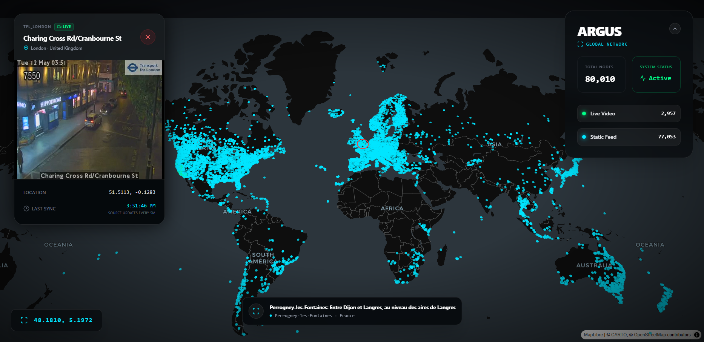

# ARGUS — Global Camera Intelligence

Argus is a high-performance, tactical surveillance dashboard designed to aggregate and visualize global open-data camera feeds. Featuring a "Skynet-style" interface, it provides real-time monitoring of over 80,000+ camera nodes across highways, landmarks, and urban centers worldwide.



## Core Features

- **Massive Global Scale**: Ingests 80,000+ cameras around 126+ countries world in 
- **Real-Time Visualization**: High-performance map rendering via Deck.GL and MapLibre.
- **Hybrid Feed Support**: Automatically switches between live HLS video streams (.m3u8) and high-frequency static JPEGs.
- **Intelligent Engine**: Plugin-based architecture for adding new regional data sources (Caltrans, DriveBC, LTA, Windy, etc.).

---

## Project Structure

The project is divided into a **React Frontend** and a **Python Data Pipeline**.

```text
Argus/
├── public/                 # Static assets & Data source
│   └── cameras.geojson     # The main 80k node dataset
├── scripts/                # Data Ingestion Pipeline
│   ├── engine.py           # Unified plugin-based aggregator (Fast/Lite)
│   ├── fetch_windy_massive.py  # The main 80k node scraper from Windy API
│   ├── fetch_windy_dense.py    # Recursive density scraper for urban areas from Windy API
│   └── scrapers/           # Regional scraper modules (USA, Asia, EU, etc.)
├── src/                    # React + TypeScript Frontend
│   ├── App.tsx             # Main Tactical Dashboard logic
│   └── index.css           # Global "Dark Matter" styling
└── .env                    # API Keys (Windy, etc.)
```

---

## Setup & Installation

### 1. Frontend Setup
Ensure you have [Node.js](https://nodejs.org/) installed.

```bash
# Install dependencies
npm install

# Start the tactical dashboard
npm run dev
```

### 2. Data Pipeline Setup (The 80k Nodes)
To generate the full 80,000+ node dataset, you must use the specialized Windy scrapers.

**Requirements:**
- Python 3.8+
- `pip install requests python-dotenv`
- A free **Windy API Key** (get one at [api.windy.com](https://api.windy.com/))

**Execution Order:**
1.  **Massive Pass**: Run the global micro-grid scraper.
    ```bash
    python scripts/fetch_windy_massive.py
    ```
2.  **Dense Pass**: Run the recursive scraper to fill in high-density regions (Europe/US).
    ```bash
    python scripts/fetch_windy_dense.py
    ```
3.  **Deployment**: The scripts save data directly to `public/cameras.geojson`. Refresh your browser to see the 80k nodes.

---

## Data Sources

| Source | Region | Node Type | API Key |
| :--- | :--- | :--- | :--- |
| **Windy.com** | Global | Landmarks / Weather | Required (Free) |
| **Caltrans** | California, USA | Traffic / Highway | Not Required |
| **DriveBC** | British Columbia, CA | Traffic / Mountain | Not Required |
| **Singapore LTA** | Singapore | Urban / Traffic | Not Required |

---

## Environment Configuration
Create a `.env` file in the root directory:
```env
WINDY_API_KEY=your_key_here
VITE_WINDY_API_KEY=your_key_here
```

---

## License
This project is for educational and open-data visualization purposes. All camera feeds are sourced from public, non-sensitive government or commercial APIs.
