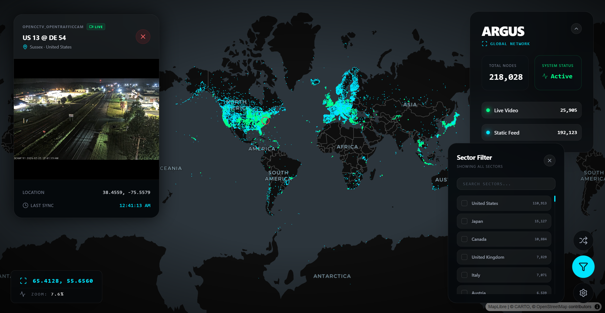
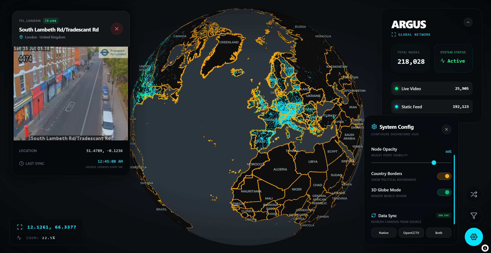

# ARGUS — Global Camera Intelligence

Argus is an open-source, real-time interactive map of **229,000+ public traffic and CCTV cameras** from government and commercial sources worldwide — highway DOT cameras, city traffic cams, and public webcams, aggregated from open data APIs and rendered on a GPU-accelerated map (with a 3D globe view built in). Dashboard for exploring live camera feeds, HLS video streams, and static snapshot imagery by country, region, or city, backed by a Python scraping pipeline that keeps the dataset current.

It's two independent halves:

- **Frontend** (`src/`) — a React + TypeScript dashboard. Reads a static JSON payload at runtime; it never talks to the scrapers directly.
- **Data pipeline** (`scripts/`) — a Python CLI that scrapes camera metadata from ~10 government/commercial sources into a local SQLite store, then exports it to the JSON payload the frontend reads.

## Features

- **2D tactical view** — thousands of camera dots over a dark MapLibre basemap, rendered with Deck.GL for performance at scale. Points below a zoom threshold are pixel-binned in a Web Worker so panning/zooming stays smooth with all 229k nodes loaded.
- **3D globe view** — the same data on a rotating globe (`react-map-gl` + MapLibre's native globe projection), toggleable from the HUD.
- **Live feed playback** — HLS streams via `hls.js` where available, falling back to a cache-busted static JPEG poll if the stream fails. A local dev-only proxy (`scripts/server.py`) resolves CORS and `ipcamlive://` streams that a browser can't reach directly.
- **Filters, settings, and a country/sector browser** for narrowing down the camera set, plus a "jump to random camera" action.
- **In-app data sync** — a Settings-panel button that (in development) triggers a scrape and re-export via the local control server, with live progress streamed into the UI.

## Showcase




## Quick Start

**Prerequisites:** Node.js `^20.19.0 || >=22.12.0` (required by Vite 8), Python 3.9+.

**Frontend**

```bash
npm install
npm run dev       # Vite dev server, http://localhost:5173
```

Other frontend commands:

```bash
npm run build      # tsc -b && vite build
npm run lint        # eslint .
npm run preview      # preview a production build locally
```

There is no test suite configured (`npm test` does not exist).

**Data pipeline** (from `scripts/`)

```bash
cd scripts
pip install requests
python scraper.py --list      # see all plugins
python scraper.py --all       # run everything
```

Camera data lives in a SQLite store (`scripts/data/cameras.db`) and is exported to `public/cameras.geojson` plus the three-tier payload the frontend reads at runtime: `cameras.core.json` (map), `cameras.labels.json` (names, loaded behind it), and `cameras.detail/` (one chunk fetched per camera opened).

**Local dev control server** (optional — powers the in-app "Data Sync" button)

```bash
python scripts/server.py    # listens on http://localhost:8787, run alongside `npm run dev`
```

## Configuration

Only the `windy` plugin needs a key — every other source is keyless. Create `.env` in the project root:

```env
WINDY_API_KEY=your_key_here
VITE_WINDY_API_KEY=your_key_here
```

Get a free key at [api.windy.com](https://api.windy.com/). Both vars must hold the same value — `WINDY_API_KEY` is used by Python, `VITE_WINDY_API_KEY` is exposed to the browser by Vite.

## Project Structure

```
Argus/
├── src/
│   ├── App.tsx           # Entire UI: HUD, settings, filters, feed panel, both map renderers
│   ├── binWorker.ts       # Pixel-binning for the 2D map at low zoom (Web Worker)
│   ├── main.tsx            # React entry point
│   └── assets/               # Demo screenshots
├── public/
│   ├── cameras.geojson       # Full dataset, one feature per camera (also used by the pipeline)
│   ├── cameras.core.json      # Positions/color/live flag — blocks first paint
│   ├── cameras.labels.json     # Names — loads in behind core
│   └── cameras.detail/          # Per-camera detail chunks, fetched on open
├── scripts/
│   ├── scraper.py             # CLI entry point — plugin registry, merge modes, maintenance passes
│   ├── store.py                 # SQLite schema + export to the three-tier payload
│   ├── server.py                  # Local-only control server behind the in-app "Data Sync" button
│   ├── scrapers/                   # One plugin per source, organized by region:
│   │   ├── usa/california/caltrans.py
│   │   ├── usa/road511.py
│   │   ├── canada/bc/drivebc.py
│   │   ├── europe/uk/tfl_london.py
│   │   ├── asia/singapore/lta.py
│   │   ├── oceania/nz/nzta.py
│   │   ├── global/windy.py
│   │   ├── opencctv_bridge.py       # Strategic bridge: syncs 200k+ nodes from OpenCCTV
│   │   ├── utils.py                  # build_feature() — normalizes every source to one schema
│   │   └── ...resolvers (ipcamlive, txdot, host_prober)
│   └── legacy/                        # Retired scripts, kept for reference only
└── archive/                             # Orphaned data files, kept instead of deleted
```

## Dataset Breakdown

Computed from the live store (`python scraper.py --stats`), 229,308 cameras total.

**By continent**

| Continent      | Cameras | Share |
| -------------- | ------: | ----: |
| North America  | 122,222 | 53.3% |
| Europe         |  67,099 | 29.3% |
| Asia           |  32,755 | 14.3% |
| Oceania        |   4,772 |  2.1% |
| South America  |   1,218 |  0.5% |
| Africa         |   1,167 |  0.5% |
| Antarctica     |      22 | <0.1% |
| Unclassified\* |      39 | <0.1% |

**By country** (every country with 1,000+ cameras — 24 of them, covering 94.5% of the dataset)

| Country                               |    Cameras |    Share |
| ------------------------------------- | ---------: | -------: |
| United States                         |    110,912 |    48.4% |
| Japan                                 |     15,127 |     6.6% |
| Canada                                |     10,884 |     4.7% |
| United Kingdom                        |      7,829 |     3.4% |
| Italy                                 |      7,071 |     3.1% |
| Austria                               |      6,539 |     2.9% |
| Taiwan                                |      6,305 |     2.7% |
| Germany                               |      6,093 |     2.7% |
| Spain                                 |      5,530 |     2.4% |
| France                                |      5,209 |     2.3% |
| Switzerland                           |      4,816 |     2.1% |
| Finland                               |      3,398 |     1.5% |
| Australia                             |      3,324 |     1.4% |
| Norway                                |      3,093 |     1.3% |
| Indonesia                             |      2,963 |     1.3% |
| Czechia                               |      2,849 |     1.2% |
| South Korea                           |      2,703 |     1.2% |
| Sweden                                |      2,684 |     1.2% |
| Vietnam                               |      2,107 |     0.9% |
| Poland                                |      1,893 |     0.8% |
| Slovenia                              |      1,548 |     0.7% |
| New Zealand                           |      1,370 |     0.6% |
| Russia                                |      1,365 |     0.6% |
| Hong Kong                             |      1,021 |     0.4% |
| **Other (149 countries/territories)** | **12,675** | **5.5%** |

<sub>\*A handful of rows (<0.1%) carry a malformed region tag from upstream sources rather than an ISO country code.</sub>

## Common Commands

| Goal                              | Command                                                     |
| --------------------------------- | ----------------------------------------------------------- |
| Camera counts by source           | `python scraper.py --stats`                                 |
| Run specific plugins              | `python scraper.py --plugins drivebc tfl_london nyc_dot`    |
| Run everything except Windy       | `python scraper.py --all --exclude windy`                   |
| Target specific US states         | `python scraper.py --plugins road511_usa --states CO TN DE` |
| Drop & refresh a source's cameras | `python scraper.py --all --replace-source`                  |
| Rebuild from scratch              | `python scraper.py --all --fresh`                           |
| Run plugins concurrently          | `python scraper.py --all --parallel`                        |

## TODO:
- [ ] Add Satellite Camereas from https://eumetview.eumetsat.int/static-images/latestImages.html

---

## License

[MIT](LICENSE). This project is for educational and open-data visualization purposes only — all camera feeds are sourced from public, non-sensitive government or commercial APIs.
