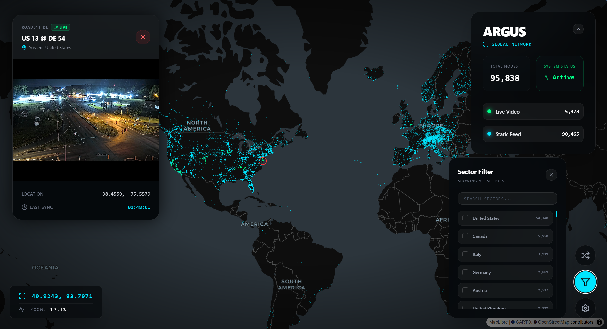
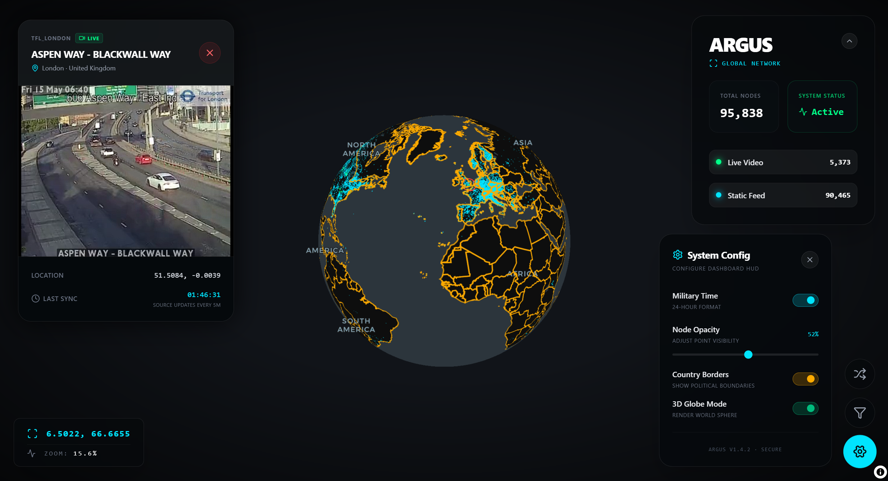

# ARGUS — Global Camera Intelligence

A tactical surveillance dashboard that aggregates and visualizes open-data camera feeds worldwide — hundreds of thousands of nodes across highways, landmarks, and urban centers, rendered on a GPU-accelerated map (Deck.GL / MapLibre).

## Demo




## Quick Start

**Frontend**
```bash
npm install
npm run dev
```

**Data pipeline** (Python 3.9+, from `scripts/`)
```bash
cd scripts
pip install requests
python scraper.py --list      # see all plugins
python scraper.py --all       # run everything
```

Camera data lives in a SQLite store (`scripts/data/cameras.db`) and is exported to `public/cameras.geojson` / `public/cameras.min.json`, which the frontend reads at runtime.

## Configuration

Only the `windy` plugin needs a key — every other source is keyless. Create `.env` in the project root:
```env
WINDY_API_KEY=your_key_here
VITE_WINDY_API_KEY=your_key_here
```
Get a free key at [api.windy.com](https://api.windy.com/). Both vars must hold the same value — `WINDY_API_KEY` is used by Python, `VITE_WINDY_API_KEY` is exposed to the browser by Vite.

## Common Commands

| Goal | Command |
|---|---|
| Camera counts by source | `python scraper.py --stats` |
| Run specific plugins | `python scraper.py --plugins drivebc tfl_london nyc_dot` |
| Run everything except Windy | `python scraper.py --all --exclude windy` |
| Drop & refresh a source's cameras | `python scraper.py --all --replace-source` |
| Rebuild from scratch | `python scraper.py --all --fresh` |

Full architecture, merge-mode semantics, maintenance passes (host-probing, resolvers), and plugin authoring live in `CLAUDE.md`.

## License

This project is for educational and open-data visualization purposes only. All camera feeds are sourced from public, non-sensitive government or commercial APIs.
